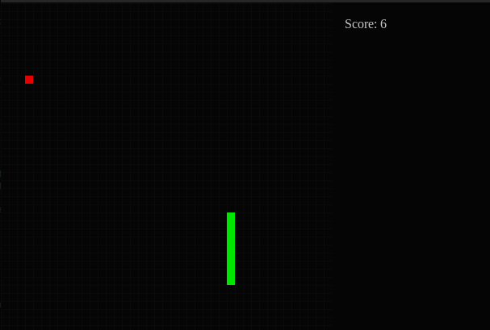
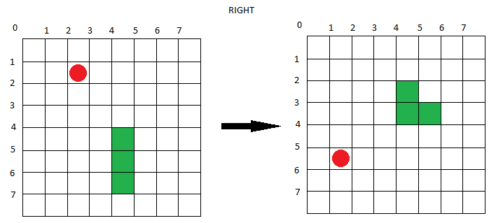
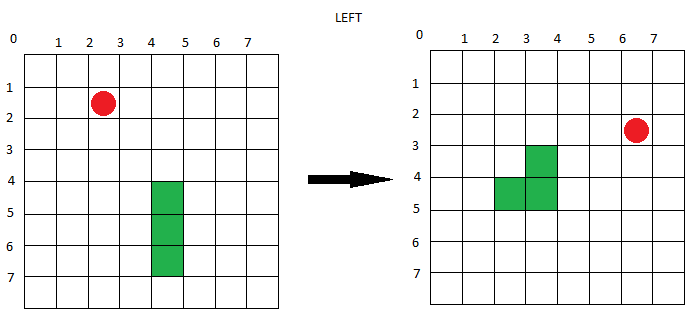

# La Serpiente

Автор: Нуньес Тайпе Александр Грегори Карлос (ИСУ 410497)

### Описание
Классическая змейка с вращением карты по направлению движения. Управление осуществляется стрелками LEFT и RIGHT.

Запустить игру можно следующим образом:
``` 
python3 snake/main.py
```



---
### Вращение карты
Вращение карты происходит следующим формулам:

$$R: (x, y) -> (y, min(x_M - x, x))$$
$$L: (x, y) -> (min(y_M - y, y), x),$$
$$где\space x_M\spaceи\space y_M - максимальные\spaceзначения\spaceосей\spaceкоординат$$





---
### Видео
[](resources/videos/la_serpiente.mp4)
